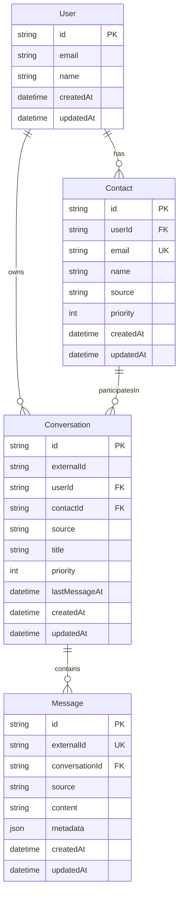

# Message Priority Engine - Design Document

## 1. System Overview

### Problem Statement
Users receive messages from multiple communication platforms (email, Slack, WhatsApp, LinkedIn) and need help focusing on what matters most. This system receives messages from these sources, calculates priority scores, and provides an API for clients to fetch prioritized conversations.

### Technology Choice: Next.js API Routes
- **Why Next.js?** Provides a clean file-based routing system for API endpoints with TypeScript support out of the box
- **Serverless-ready**: API routes deploy easily to Vercel or similar platforms
- **Familiar ecosystem**: Well-documented, large community, easy to onboard team members
- **Rapid development**: Focus on business logic rather than boilerplate

### Scope
- REST API design with mocked data layer
- Priority calculation logic
- Real-time update strategy (design only)

---

## 2. Data Models

### Entity Relationship Diagram



### Model Definitions

#### User
| Field | Type | Description |
|-------|------|-------------|
| id | string (UUID) | Primary key |
| email | string | User's email address |
| name | string | Display name |
| createdAt | datetime | Record creation timestamp |
| updatedAt | datetime | Last update timestamp |

#### Contact
| Field | Type | Description |
|-------|------|-------------|
| id | string (UUID) | Primary key |
| userId | string (UUID) | Foreign key to User |
| email | string | Contact's email (unique per user, used for deduplication) |
| name | string | Contact's display name |
| source | enum | Original source where contact was discovered |
| priority | int (0-100) | Base priority score for this contact |
| createdAt | datetime | Record creation timestamp |
| updatedAt | datetime | Last update timestamp |

#### Conversation
| Field | Type | Description |
|-------|------|-------------|
| id | string (UUID) | Primary key |
| externalId | string | Conversation ID from the external system |
| userId | string (UUID) | Foreign key to User |
| contactId | string (UUID) | Foreign key to Contact (1:1 user-contact per conversation) |
| source | enum | Source platform (email, slack, whatsapp, linkedin) |
| title | string | Conversation title/subject |
| priority | int (0-100) | Calculated priority score |
| lastMessageAt | datetime | Timestamp of most recent message |
| createdAt | datetime | Record creation timestamp |
| updatedAt | datetime | Last update timestamp |

#### Message
| Field | Type | Description |
|-------|------|-------------|
| id | string (UUID) | Primary key |
| externalId | string | Message ID from the external system (for deduplication) |
| conversationId | string (UUID) | Foreign key to Conversation |
| source | enum | Source platform |
| content | string | Message body/content |
| metadata | json | Provider-specific metadata |
| createdAt | datetime | Record creation timestamp |
| updatedAt | datetime | Last update timestamp |

> **Note:** `contactId` is not stored on Message since it can be derived via Conversation. This avoids data inconsistency.

#### Source Enum
```typescript
type Source = 'email' | 'slack' | 'whatsapp' | 'linkedin';
```

---

## 3. API Endpoints

### Common Patterns

**Error Response Format:**
```typescript
{
  error: {
    code: string;        // Machine-readable error code
    message: string;     // Human-readable description
  }
}
```

| Status Code | When |
|-------------|------|
| 400 | Invalid request body / validation failure |
| 404 | Resource not found |
| 409 | Duplicate message (idempotency check) |
| 500 | Internal server error |

---

### Message Ingestion Endpoints

Each provider has a dedicated endpoint with provider-specific request schemas and processing logic.

**Idempotency:** Messages are deduplicated by `externalId` (the message ID from the source system). If a message with the same `externalId` already exists, the endpoint returns `409 Conflict` with the existing message data. This ensures webhooks can safely retry.

---

#### `POST /api/messages/email`

Ingests email messages. Handles email-specific parsing like headers, thread IDs, and subject extraction.

**Request Body:**
```typescript
{
  userId: string;                  // User receiving the message
  externalMessageId: string;       // Unique message ID from email system (for idempotency)
  externalConversationId: string;  // Email thread ID
  from: {
    email: string;                 // Sender email (used for contact deduplication)
    name: string;                  // Sender display name
  };
  subject: string;                 // Email subject line
  body: string;                    // Email body content
  receivedAt: string;              // ISO timestamp
  metadata?: {
    hasAttachments?: boolean;
    isReply?: boolean;
    importance?: 'low' | 'normal' | 'high';  // Email importance header
  };
}
```

**Response:** `201 Created`
```typescript
{
  messageId: string;
  conversationId: string;
  contactId: string;
  priority: number;
}
```

**Provider-Specific Logic:**
- Parse email importance headers to boost priority
- Extract thread-id for conversation grouping
- Check for reply indicators

---

#### `POST /api/messages/slack`

Ingests Slack messages. Handles Slack-specific context like channels, threads, and mentions.

**Request Body:**
```typescript
{
  userId: string;
  externalMessageId: string;       // Slack message ts (for idempotency)
  externalConversationId: string;  // Channel ID or DM ID
  from: {
    email: string;                 // Slack user's email
    name: string;                  // Slack display name
    slackUserId?: string;          // Slack user ID
  };
  content: string;                 // Message text
  receivedAt: string;
  metadata?: {
    channelName?: string;
    threadTs?: string;             // Thread timestamp for threaded replies
    mentions?: string[];           // @mentioned users
    isDirectMessage?: boolean;
  };
}
```

**Response:** `201 Created`
```typescript
{
  messageId: string;
  conversationId: string;
  contactId: string;
  priority: number;
}
```

**Provider-Specific Logic:**
- Boost priority for direct messages over channel messages
- Check for @mentions of the user
- Handle thread context via thread_ts

---

#### `POST /api/messages/whatsapp`

Ingests WhatsApp messages. Handles phone-based contact matching and media types.

**Request Body:**
```typescript
{
  userId: string;
  externalMessageId: string;       // WhatsApp message ID (for idempotency)
  externalConversationId: string;  // WhatsApp chat ID
  from: {
    email: string;                 // Contact email (if available)
    name: string;                  // Contact name
    phone: string;                 // Phone number
  };
  content: string;                 // Message content
  receivedAt: string;
  metadata?: {
    messageType?: 'text' | 'image' | 'video' | 'audio' | 'document';
    isForwarded?: boolean;
    isGroupChat?: boolean;
  };
}
```

**Response:** `201 Created`
```typescript
{
  messageId: string;
  conversationId: string;
  contactId: string;
  priority: number;
}
```

**Provider-Specific Logic:**
- Use phone number as fallback for contact matching
- Handle media message types
- Deprioritize forwarded messages

---

#### `POST /api/messages/linkedin`

Ingests LinkedIn messages. Handles connection-based context and profile metadata.

**Request Body:**
```typescript
{
  userId: string;
  externalMessageId: string;       // LinkedIn message ID (for idempotency)
  externalConversationId: string;  // LinkedIn conversation ID
  from: {
    email: string;                 // LinkedIn email
    name: string;                  // Profile name
    linkedinUrl?: string;          // Profile URL
  };
  content: string;
  receivedAt: string;
  metadata?: {
    connectionDegree?: 1 | 2 | 3;  // Connection degree
    isInMail?: boolean;            // Paid InMail vs regular message
    profileHeadline?: string;
  };
}
```

**Response:** `201 Created`
```typescript
{
  messageId: string;
  conversationId: string;
  contactId: string;
  priority: number;
}
```

**Provider-Specific Logic:**
- Boost priority for 1st-degree connections
- Handle InMail differently (often recruiters/sales)
- Extract professional context from profile data

---

### Conversation Retrieval Endpoints

---

#### `GET /api/conversations`

Returns a paginated list of conversations sorted by priority (highest first), with `createdAt` as the secondary sort (newest first) for conversations with equal priority.

**Query Parameters:**
| Parameter | Type | Default | Description |
|-----------|------|---------|-------------|
| userId | string | required | Filter by user |
| page | int | 1 | Page number |
| limit | int | 20 | Items per page (max 100) |
| source | enum | - | Optional filter by source |

**Response:** `200 OK`
```typescript
{
  data: Array<{
    id: string;
    externalId: string;
    source: Source;
    title: string;
    priority: number;          // Returns 0 for inactive conversations
    lastMessageAt: string;
    contact: {
      id: string;
      name: string;
      email: string;
    };
    messageCount: number;
    createdAt: string;
    updatedAt: string;
  }>;
  pagination: {
    page: number;
    limit: number;
    total: number;
    totalPages: number;
  };
}
```

**Sorting:**
```sql
ORDER BY priority DESC, created_at DESC
```
- Primary: `priority` descending (highest priority first)
- Secondary: `createdAt` descending (newest first when priorities are equal)
- Inactive conversations (no messages for 7+ days) return `priority: 0`

---

#### `GET /api/conversations/:id`

Returns detailed information for a single conversation.

**Response:** `200 OK`
```typescript
{
  id: string;
  externalId: string;
  source: Source;
  title: string;
  priority: number;
  lastMessageAt: string;
  contact: {
    id: string;
    name: string;
    email: string;
    priority: number;
  };
  user: {
    id: string;
    name: string;
    email: string;
  };
  messageCount: number;
  latestMessage: {
    id: string;
    content: string;
    createdAt: string;
  } | null;
  createdAt: string;
  updatedAt: string;
}
```

---

#### `GET /api/conversations/:id/messages`

Returns a paginated list of messages within a conversation, sorted by creation date (oldest first).

**Query Parameters:**
| Parameter | Type | Default | Description |
|-----------|------|---------|-------------|
| page | int | 1 | Page number |
| limit | int | 50 | Items per page (max 100) |

**Response:** `200 OK`
```typescript
{
  data: Array<{
    id: string;
    source: Source;
    content: string;
    metadata: Record<string, unknown>;
    contact: {
      id: string;
      name: string;
    };
    createdAt: string;
    updatedAt: string;
  }>;
  pagination: {
    page: number;
    limit: number;
    total: number;
    totalPages: number;
  };
}
```

---

## 4. Priority Calculation Logic

### Overview

Priority is calculated on a scale of **0-100** where higher values indicate higher priority. The conversation priority is recalculated each time a new message arrives.

> **Sync vs Async:** For this prototype, priority is calculated synchronously during message ingestion. At scale (10M+ messages/day), this would move to an async queue to keep ingestion latency low.

### Priority Signals

| Signal | Range | Weight | Description |
|--------|-------|--------|-------------|
| Contact Priority | 0-100 | 40% | Base priority from the contact record |
| Urgency Keywords | 0-20 | 20% | Boost from urgent language in message |
| Recency | 0-20 | 20% | Score based on message age |
| Response Expectation | 0-15 | 15% | Based on platform norms |
| Provider Boost | -10 to +10 | 5% | Provider-specific adjustments |

### Calculation Formula

Each signal is normalized to a 0-100 scale, multiplied by its weight, then summed. The final score is clamped to 0-100.

> **Note:** Weights would be tuned based on user feedback and engagement data in production.

### Signal Details

#### Contact Priority (0-100, 40% weight)
- Default: 50 for new contacts
- Adjusts based on interaction history (future enhancement)
- Can be manually set by user

#### Urgency Keywords (+0-20)
Keywords that boost priority:
- **High (+15-20)**: "urgent", "asap", "emergency", "critical", "deadline"
- **Medium (+5-10)**: "important", "priority", "needed", "soon"
- **Low (+0-5)**: "when you can", "quick question"

#### Recency Score (0-20)

| Time Since Last Message | Score |
|------------------------|-------|
| < 1 hour | 20 |
| < 4 hours | 15 |
| < 24 hours | 10 |
| < 72 hours | 5 |
| Older | 0 |

### Priority Reset for Inactive Conversations

Conversations with no new messages for **7 days** (configurable) are reset to priority 0. This ensures stale conversations don't remain at the top of the list indefinitely.

**Implementation Options:**
1. **On-read (lazy)**: Check inactivity when fetching conversations, return 0 for inactive ones
2. **Scheduled job (eager)**: Run a periodic job (e.g., daily) to reset priorities in the database

For the prototype, we'll use the lazy approach. At scale, a scheduled job is more efficient.

#### Response Expectation (0-15)
Based on platform norms:
- **Email**: +5 (async, lower urgency expectation)
- **Slack**: +12 (near real-time expectation)
- **WhatsApp**: +15 (immediate response expected)
- **LinkedIn**: +3 (professional, less urgent)

#### Provider-Specific Boosts (-10 to +10)
- **Email**: +5 if importance header is "high", -5 if newsletter detected
- **Slack**: +10 for DMs, +5 for @mentions, -5 for channel noise
- **WhatsApp**: -5 for forwarded messages, -10 for group chats
- **LinkedIn**: +5 for 1st-degree connections, -5 for InMail (often sales)

---

## 5. Real-Time Update Strategy

### Options Considered

| Approach | Pros | Cons |
|----------|------|------|
| **Polling** | Simple, works everywhere | Inefficient, latency |
| **Server-Sent Events (SSE)** | Simple, HTTP-based, good browser support | Unidirectional only |
| **WebSocket** | Bidirectional, low latency | More complex, connection management |

### Recommended Approach: Server-Sent Events (SSE)

For this use case, **SSE is recommended** because:
1. Updates are server-to-client only (new messages arrive, client displays)
2. Simpler implementation than WebSocket
3. Built-in reconnection handling
4. Works with HTTP/2 multiplexing

### Event Types

| Event | Trigger |
|-------|---------|
| `conversation:updated` | Priority or lastMessageAt changed |
| `conversation:new` | New conversation created |
| `message:new` | New message in a conversation |

Endpoint: `GET /api/conversations/stream`

### Fallback: Polling

For environments where SSE is not available:
- `GET /api/conversations?since={timestamp}` 
- Poll every 30 seconds
- Returns only conversations updated since timestamp

---

## 6. Trade-offs and Future Considerations

### What's Simplified/Mocked
- **Database**: Using in-memory store instead of real database
- **Authentication**: No auth implementation (assume userId is provided)
- **External integrations**: No actual webhook integrations with providers
- **Contact deduplication**: Assumes email is always available for matching (not realistic for WhatsApp/phone-based platforms)
- **Contact priority**: Static score rather than derived from business context (deals, churn risk, customer tier)

### Design Trade-offs Made

| Decision | Trade-off |
|----------|-----------|
| 1 contact per conversation | Simplicity over group chat support |
| Email-based deduplication | May miss same person with different emails |
| Priority recalculated on each message | Compute cost for up-to-date priorities |
| REST vs GraphQL | REST is the right choice for ingestion (webhooks/external integrations universally use REST), but GraphQL would be better for read operations in an admin portal where clients need flexible queries across related data in a single request |

### Future Enhancements

1. **Multi-contact conversations**: Support group chats and email threads with multiple recipients. Current design assumes 1:1 user-contact conversations.

2. **Robust contact deduplication**: Current implementation assumes email is always available for deduplication, which won't hold true in production:
   - WhatsApp primarily uses phone numbers
   - Some platforms may only provide usernames/handles
   - Need cross-platform identity resolution (e.g., matching phone to email via address book sync)
   - Consider fuzzy matching on name + other signals

3. **Contact priority model**: Current priority is a simple 0-100 score, but real prioritization needs business context:
   - Is this contact part of an **active deal**? (CRM integration)
   - Is this a **high churn risk** customer? (Usage/support data)
   - What's their **customer tier** (enterprise vs free)?
   - Have they been **unresponsive** to outreach?
   - Priority should likely be derived from multiple business signals rather than a static score

4. **GraphQL for read operations**: While REST is the right choice for ingestion (webhook compatibility), read operations in an admin portal would benefit from GraphQL:
   - Fetch conversation + contact + recent messages in a single request
   - Client-driven field selection reduces over-fetching
   - Better performance for complex UI dashboards with related data

### Scaling Considerations

| Scale Challenge | Solution |
|-----------------|----------|
| 10K users × 1K messages/day = 10M messages/day | Message queue for ingestion, async priority calculation |
| Priority recalculation load | Cache conversation priorities, recalculate on-demand |
| Real-time updates at scale | Redis pub/sub for SSE, partition by user |
| Storage growth | Time-based partitioning, archive old messages |
| Webhook abuse / rate limiting | Per-source rate limits, exponential backoff for retries |

---

## 7. File Structure

```
kinso-poc/
├── src/
│   ├── app/
│   │   └── api/
│   │       ├── messages/
│   │       │   ├── email/
│   │       │   │   └── route.ts
│   │       │   ├── slack/
│   │       │   │   └── route.ts
│   │       │   ├── whatsapp/
│   │       │   │   └── route.ts
│   │       │   └── linkedin/
│   │       │       └── route.ts
│   │       └── conversations/
│   │           ├── route.ts              # GET /conversations
│   │           └── [id]/
│   │               ├── route.ts          # GET /conversations/:id
│   │               └── messages/
│   │                   └── route.ts      # GET /conversations/:id/messages
│   └── lib/
│       ├── types.ts                      # TypeScript interfaces
│       ├── priority.ts                   # Priority calculation logic
│       └── store.ts                      # In-memory mock database
├── DESIGN.md
└── README.md
```

> **Auth Note:** In production, `userId` would be derived from an authenticated session (JWT/cookie), not passed in the request body. For this prototype, we accept `userId` explicitly to simplify testing.

---

## Summary

This design provides a clean REST API for message prioritization with:
- **4 explicit ingestion endpoints** with provider-specific logic
- **3 retrieval endpoints** for accessing prioritized conversations
- **Transparent priority scoring** based on multiple signals
- **SSE-based real-time updates** with polling fallback
- **Clear data model** optimized for the 1:1 user-contact conversation pattern

The implementation prioritizes simplicity and correctness over premature optimization, with clear paths for scaling when needed.
