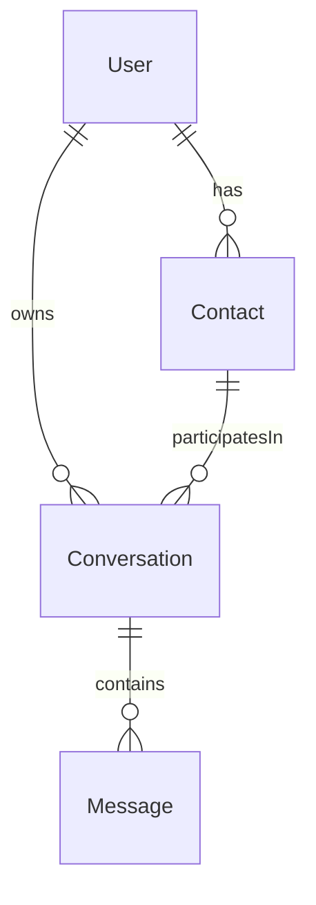

# Message Priority Engine - Design

## Data Model



### The Main Pieces

**User** - The person using the app. Has an email and name.

**Contact** - Someone you're talking to. Each contact has a base priority score (0-100) that affects how urgent their messages feel.

**Conversation** - A thread between you and a contact. Grouped by source (email, Slack, etc.) and has a calculated priority.

**Message** - An individual message. Has an `externalId` for deduplication so webhooks can safely retry.

---

## API Endpoints

### Receiving Messages

Each platform gets its own endpoint because they all work differently:

| Endpoint | What It Handles |
|----------|-----------------|
| `POST /api/messages/email` | Email headers, thread IDs, importance flags |
| `POST /api/messages/slack` | Channels, threads, @mentions, DMs |
| `POST /api/messages/whatsapp` | Phone numbers, media types, forwarded messages |
| `POST /api/messages/linkedin` | Connection degree, InMail vs regular messages |

All of them return `201 Created` with the new message ID and calculated priority. If you send the same message twice (same `externalId`), you get `409 Conflict`—this makes webhook retries safe.

### Reading Conversations

| Endpoint | What You Get |
|----------|--------------|
| `GET /api/conversations` | Paginated list, sorted by priority |
| `GET /api/conversations/:id` | Single conversation with contact details |
| `GET /api/conversations/:id/messages` | Messages in a conversation |

---

## How Priority Works

Priority is a score from 0-100. Higher = more urgent. It's recalculated whenever a new message arrives.

### The Signals

| Signal | Weight | What It Measures |
|--------|--------|------------------|
| Contact Priority | 40% | How important is this person? |
| Urgency Keywords | 20% | Words like "urgent", "asap", "deadline" |
| Recency | 20% | How fresh is the conversation? |
| Response Expectation | 15% | Platform norms (Slack = fast, email = slow) |
| Provider Boost | 5% | Platform-specific tweaks |

### Examples

**Urgency keywords:**
- "urgent", "asap", "emergency" → big boost
- "important", "priority" → medium boost
- "quick question" → small boost

**Recency:**
- Under 1 hour ago → +20
- Under 4 hours → +15
- Under 24 hours → +10
- Under 72 hours → +5
- Older → +0

**Platform response expectations:**
- WhatsApp → +15 (people expect instant replies)
- Slack → +12 (near real-time)
- Email → +5 (async is normal)
- LinkedIn → +3 (professional, less urgent)

**Platform-specific boosts:**
- Email marked "high importance" → +5
- Slack DM → +10
- LinkedIn 1st-degree connection → +5
- Forwarded WhatsApp → -5
- LinkedIn InMail → -5 (usually sales)

### Stale Conversations

If a conversation has no activity for 7 days, its priority drops to 0. This keeps old threads from cluttering the top of your list.

---

## Real-Time Updates

We use **Server-Sent Events (SSE)** at `GET /api/conversations/stream`.

Why SSE? It's simpler than WebSockets, has built-in reconnection, and we only need server-to-client updates anyway.

**Events:**
- `conversation:updated` — priority changed
- `conversation:new` — new conversation started
- `message:new` — new message arrived

---

## What's Simplified for This Prototype

| Thing | Simplification |
|-------|----------------|
| Database | In-memory (no persistence) |
| Auth | None—userId passed in requests |
| Integrations | No real webhooks, just the API |
| Contact matching | Assumes email is always available |

---

## Trade-offs We Made

**1 contact per conversation** — Keeps it simple, but means no group chat support.

**Email-based deduplication** — Works for most cases, but might miss the same person using different email addresses.

**Priority calculated on every message** — Always up-to-date, but more CPU work.

**REST over GraphQL** — REST is standard for webhooks. For a real admin UI, GraphQL would be better for flexible queries.

---

## What Would Change at Scale

- Priority calculation can't be synchronous when processing millions of messages
- Storage growth as message history accumulates
- Real-time updates across thousands of concurrent connections

---

## File Structure

```
src/
├── app/api/
│   ├── messages/
│   │   ├── email/route.ts
│   │   ├── slack/route.ts
│   │   ├── whatsapp/route.ts
│   │   └── linkedin/route.ts
│   └── conversations/
│       ├── route.ts
│       ├── stream/route.ts
│       └── [id]/
│           ├── route.ts
│           └── messages/route.ts
└── lib/
    ├── types.ts      # TypeScript types
    ├── priority.ts   # Priority calculation
    └── store.ts      # In-memory database
```

---
